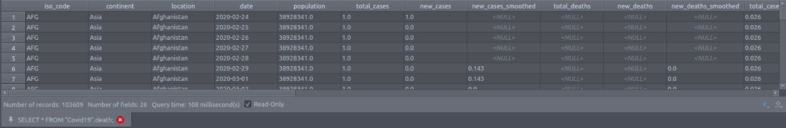
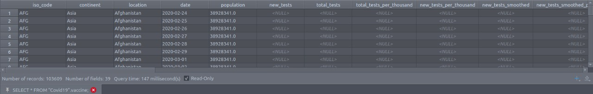

# Exploring Covid-19

  
## Introduction
  

The Covid-19 pandemic has changed our lives in a way we have not been prepared for. Thinking about this, I decided to practice my SQL muscles exploring some data about the COVID-19 around the world using PostgreSQL and Tableau for visualization. In this project I will walk through an SQL data exploration, cleaning and visualization in Tableau.  
The dataset can be downloaded at [Our World in Data](https://ourworldindata.org/covid-deaths).  
I hope to exercise and improve my SQL skills. Feel free to give your feedback. This is a really basic project, so let's get into it, hope you enjoy! 
  

## The data 

This is a time series dataset, that contains daily updated of the worldwide number of new cases, total cases, new deaths, total deaths, new vaccinations, total vaccinations and more.
Bellow one can see a sample of the data set. The original file is a .csv containing all the information. For a better performance when querying, it was split into two separated tables, one with all the cases and deaths information and the
other containing the vaccinations and other information.

Deaths table

Vaccination table

## The exploratory data analysis
  

In this first part of the project will performed a simple exploratory data analysis on the data to discover some numbers about the COVID-19 pandemic in the World, and, specifically, in Brazil.  
Summarising, the following questions were answered:  
<ol>
<li> <b>What are the total cases, deaths and the <i>lethallity rate</i> (percent of people who died after get infected by COVID-19) in the world?</b> </li>
This question can be answered by simple querying the death table and make a division of the total cases and the new deaths.

    SELECT sum(new_cases::NUMERIC) AS "global_total_cases",
                    sum(new_deaths::NUMERIC) AS "total_deaths",
                    round(sum(new_deaths::NUMERIC)/sum(new_cases::NUMERIC), 2)*100 AS "global_lethallity_rate"
    FROM "Covid19".death
    WHERE continent IS NOT NULL;

<li> <b>Considering each of the continents, how many people have passed way until now (2021/07/21)?</b> </li>

This question can be answered using a GROUP BY operation on the continent column. Note that it is necessary to imply the condition that the continent must be not null,
for in this table some records brings the "location" as the continent, and when it happens, the "continent" column is null.

    SELECT "continent", sum(new_deaths::NUMERIC) AS "total_deaths"
    FROM "Covid19".death
    WHERE continent IS NOT NULL
    GROUP BY continent
    ORDER BY "total_deaths" DESC;

<li> <b>Until now, what is the <i>infection rate</i> (percent of population that has been infect by COVID-19) country-wise?</b> </li>

This question is not so different from the previous one. It is necessary to use a GROUP BY location. The new feature of this query
is that if we want to see the relation of the infection rate with the total deaths, cases and vaccinations it will be necessary to join
the *death* table with the *vaccination* table.

    SELECT d.location AS "country",
                    COALESCE(sum(new_deaths::NUMERIC), 0) AS "total_deaths",
                    COALESCE(sum(new_cases::NUMERIC), 0) AS "total cases",
                    COALESCE(sum(v.new_vaccinations::NUMERIC), 0) AS "total_vaccinations",
                    COALESCE((sum(new_cases::NUMERIC)/avg(d.population::NUMERIC))*100, 0) AS "infection_rate"
    FROM "Covid19".death AS d
    JOIN "Covid19".vaccine AS v USING("location", "date")
    WHERE d.continent IS NOT NULL
    GROUP BY "location"
    ORDER BY d.location;

<li> <b>Considering <b>Brazil</b>, what looks likes the evolution of new cases and the percent of population vaccinated?</b></li>

To obtain this answer it will be necessary to use a View. We first create a View by selecting some basic information,
like new vaccinations, deaths and cases, day by day. And then we create a partition by location to create a cumulative sum of the new
vaccinations.

    DROP VIEW if exists cum_vacc;
    CREATE VIEW cum_vacc AS 
        SELECT d.continent, d.location, d.date, d.population,
            COALESCE(v.new_vaccinations::NUMERIC, 0) AS "new_vaccinations",
            COALESCE(d.new_deaths::NUMERIC, 0) AS "new_deaths",
            COALESCE(d.new_cases::NUMERIC, 0) AS "new_cases",
            COALESCE(sum(v.new_vaccinations::NUMERIC)
                OVER (PARTITION BY d.location
                      ORDER BY d.location, d.date), 0) AS "cumulative_vaccination"
    
        FROM "Covid19".death AS d
        JOIN "Covid19".vaccine AS v USING("location", "date")
        WHERE d.continent IS NOT NULL
        ORDER BY d.location, d.date;
    
    
    SELECT "date", "location", new_cases, new_deaths, new_vaccinations, cumulative_vaccination, (cumulative_vaccination::NUMERIC/population::NUMERIC)*100 AS "percentage_vaccinated"
    FROM cum_vacc
    WHERE "location" = 'Brazil'
    ORDER BY "date";

</ol>
 

For the visualization, it was exported the above queries answers in .xmlx format to make a Dashboard using Tableau. Bellow you can see the static Dashboard image. For the interactive view of this Dashboard, please visit [my page](https://public.tableau.com/app/profile/michel.de.ara.jo/viz/COVID-19innumbers_16268902575460/Dashboard1?publish=yes) at Tableau Public.  

## Conclusion

In this project we gained insights about the COVID-19 Pandemic. We saw global numbers like lethality rate, death rate and total deaths,
as well as continent-wise number of deaths, death rate country-wise and how the COVID-19 evolved in Brazil throughout.

It is possible to conclude, by visualizing the Dashboard, that countries physically isolated from the rest of the world
have a much better isolation capability, for Oceania has presented the smallest number of deaths. It is also worthy to note that it takes
some months after the vaccination begins to the new cases numbers starts to fell down. This insight shows us that we must stay at home even if we already
had taken the first dose of vaccination, for it is not sufficient to break down the virus spreading.

