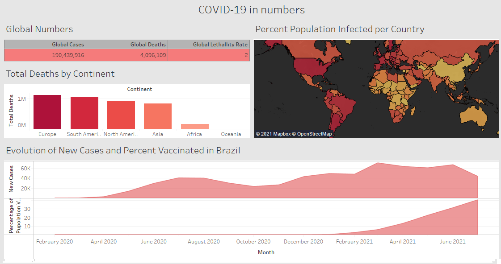

# Exploring Covid-19

  
## Introduction
  

The Covid-19 pandemic has changed our lives in a way we have not been prepared for. Thinking about this, I decided to practice my SQL muscles exploring some data about the Covid around the world using PostgreSQL and Tableau for visualization. In this project I will walk through a SQL data exploration, cleaning and visualization in Tableau.  
The dataset can be downloaded at [Our World in Data](https://ourworldindata.org/covid-deaths).  
I hope to exercise and improve my SQL skills. Feel free to give your feedback. This is a really basic project, so let's get into it, hope you enjoy! 
  

## The exploratory data analysis
  

In this first part of the project I will perform a simple exploratory data analysis on the data to discover some numbers about the COVID-19 pandemic in the World, and, specifically, in Brazil.  
Summarising, I have answered the following questions:  
<ol>
<li>What are the total cases, deaths and the <i>lethallity rate</i> (percent of people who died after get infected by COVID-19) in the world?</li>
<li>Considering each of the continents, how many people have passed way until now (2021/07/21)?</li>
<li>Until now, what are the <i>infection rate</i> (percent of population that has been infect by COVID-19) country-wise?</li>
<li>Considering <b>Brazil</b>, what looks likes the evolution of new cases and the percent of population vaccinated?</li>
</ol>
 

For the visualization I have exported the above queries answers in xmlx formart to make a Dashboard using Tablaeu. Bellow you can see the static Dashboard image. For the interactive view of this Dashboard, please visit [my page](https://public.tableau.com/app/profile/michel.de.ara.jo/viz/COVID-19innumbers_16268902575460/Dashboard1?publish=yes) at Tableau Public.  

(continues)
  

